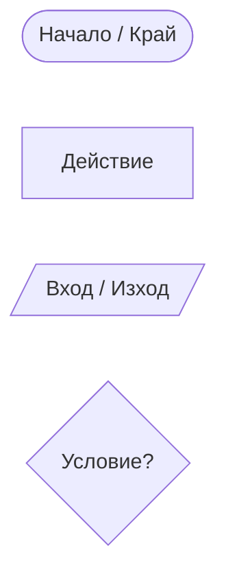
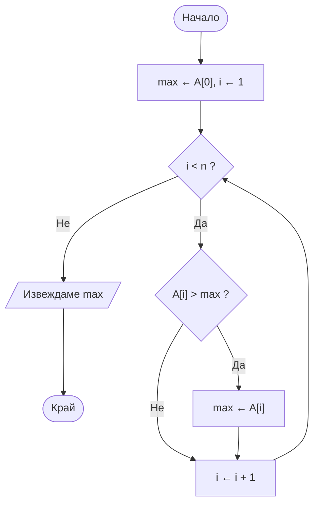
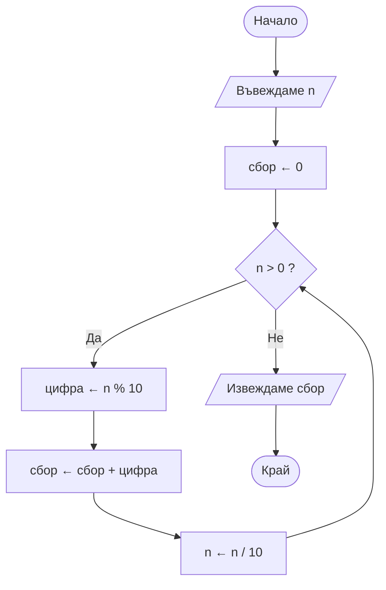

# Псевдокод и блок-схеми

---

## Какво ще научим днес?

- Защо описваме алгоритми, преди да ги пишем на конкретен език
- Какво е псевдокод и как се пише
- Какво е блок-схема (flowchart) и основните ѝ символи
- Примери - един и същ алгоритъм с псевдокод и с блок-схема

---

## Мотивация

- В миналия урок видяхме, че алгоритъмът е идея, независима от езика за програмиране
- Проблем: ако опишем идеята директно на C++ или Python -
  - Обвързваме се със синтаксиса на езика твърде рано
  - По-трудно е да обсъдим идеята с други хора, които не знаят точно този език
  - По-лесно правим грешки в логиката, докато мислим и за синтаксис
- Затова първо описваме алгоритъма **неформално** - с псевдокод или блок-схема - и чак после го превеждаме в код

```
Идея → Псевдокод / Блок-схема → Код на конкретен език
```

---

## Какво е псевдокод?

- **Псевдокод** е полу-формален начин да опишем алгоритъм - близък е до естествен език, но структуриран като код
- Няма строг синтаксис - целта е яснота, не компилируемост
- Използва се, за да:
  - Планираме логиката, преди да пишем реален код
  - Комуникираме алгоритъм независимо от езика за програмиране
  - Се фокусираме върху **логиката**, а не върху синтактични детайли

---

## Конвенции за писане на псевдокод

Няма единен стандарт, но обичайно се използват:

- `←` или `=` за присвояване: `x ← 5`
- `if ... then ... else ...` за условия
- `while ...` / `for each ...` / `for i from ... to ...` за цикли
- `function име(параметри)` за дефиниция на функция
- `return стойност` за резултат от функция
- Ключовите думи се пишат на английски (като в повечето учебници и езици за програмиране), а имената и коментарите могат да са на български
- Отстъп (indentation), за да покажем кой код е "вътре" в блок (условие, цикъл, функция)
- Коментари с `//`, ако е нужно пояснение

---

## Пример 1: Най-голямо число в списък

**Словесно описание:**

- Приемаме, че първият елемент е най-голям, после сравняваме с всеки следващ

**Псевдокод:**

```
function намериМаксимум(масив A с n елемента)
    max ← A[0]
    for i from 1 to n - 1:
        if A[i] > max then:
            max ← A[i]
    return max
```

---

## Пример 2: Проверка дали число е просто

```
function еПросто(n)
    if n < 2 then:
        return false
    for i from 2 to корен_квадратен(n):
        if n % i == 0 then:
            return false
    return true
```

- Псевдокодът чете почти като английски/български текст, но е достатъчно точен, за да се превърне директно в код

---

## Какво е блок-схема (flowchart)?

- **Блок-схема** е визуално представяне на алгоритъм чрез свързани геометрични фигури и стрелки
- Всяка фигура има конкретно значение (тип действие)
- Стрелките показват **посоката на изпълнение** - потока на алгоритъма
- Полезна е за:
  - Визуализиране на логиката, особено при разклонения и цикли
  - Обяснение на алгоритъм на хора без опит в програмирането

---

## Основни символи на блок-схема



- **Овал** (`([...])`) - начало или край на алгоритъма
- **Правоъгълник** (`[...]`) - стъпка/обработка (напр. `x ← x + 1`)
- **Паралелограм** (`[/.../]`) - четене на вход / извеждане на резултат
- **Ромб** (`{...}`) - условие/решение (два изхода - Да / Не)

- Стрелките (→ ↓) свързват фигурите и показват реда на изпълнение

---

## Пример: Блок-схема за "Най-голямо число в списък"



- Забележете цикъла - стрелката от `i ← i + 1` се връща обратно към условието `i < n ?`
- Това е визуалният еквивалент на `for i from 1 to n - 1` от псевдокода

---

## Псевдокод срещу блок-схема

| Псевдокод                     | Блок-схема                             |
| ----------------------------- | -------------------------------------- |
| Текстов, бърз за писане       | Визуален, по-бавен за рисуване         |
| По-удобен за сложни алгоритми | По-удобна за прости, кратки алгоритми  |
| По-близък до реалния код      | По-лесна за обяснение на хора без опит |
| Предпочитан от програмисти    | Предпочитана в документация, обучение  |

- И двата описват **един и същ** алгоритъм по различен начин - изборът зависи от аудиторията и целта

---

## От псевдокод/блок-схема към код

- Всяка стъпка от псевдокода обикновено съответства на 1-2 реда код
- Всяка фигура от блок-схемата съответства на структура в кода:
  - Правоъгълник → присвояване/оператор
  - Ромб → `if`/`while`
  - Паралелограм → вход/изход (`cin`/`cout`)

```cpp
int findMax(vector<int>& A) {
    int max = A[0];
    for (int i = 1; i < A.size(); i++) {
        if (A[i] > max) {
            max = A[i];
        }
    }
    return max;
}
```

- Сравнете реда: `max ← A[0]` → `int max = A[0];`, `for i from 1 to n - 1` → `for (int i = 1; i < A.size(); i++)`

---

## Нов проблем: Сбор от цифрите на число

**Проблем:** Дадено е естествено число `n`. Да се намери сборът от неговите цифри.

- Пример: `n = 2749` → `2 + 7 + 4 + 9 = 22`
- Как да "достигнем" до отделните цифри на числото?

---

## Базова идея

- Последната цифра на число се получава с остатък при деление на 10: `2749 % 10 = 9`
- Ако махнем последната цифра с целочислено деление на 10, получаваме ново, по-късо число: `2749 / 10 = 274`
- Повтаряме, докато числото свърши (стане 0)

| Число | Последна цифра (`% 10`) | Сбор дотук | Остава (`/ 10`) |
| ----- | ----------------------- | ---------- | --------------- |
| 2749  | 9                       | 9          | 274             |
| 274   | 4                       | 13         | 27              |
| 27    | 7                       | 20         | 2               |
| 2     | 2                       | 22         | 0               |

- Числото е станало 0 → спираме. Отговорът е **22**

---

## Алгоритъм - словесно описание

- Започваме със сбор 0
- Докато числото не е 0: взимаме последната му цифра, прибавяме я към сбора и махаме последната цифра от числото
- Когато числото стане 0, сборът е резултатът

---

## Алгоритъм - формално словесно описание

1. **Вход:** естествено число `n`
2. **Изход:** сборът `сбор` от цифрите на `n`
3. Задаваме `сбор` да е равно на 0
4. Ако `n` е равно на 0, преминаваме към стъпка 8
5. Задаваме `цифра` да е равно на остатъка от делението на `n` на 10
6. Увеличаваме `сбор` с `цифра` и задаваме `n` да е равно на целочисленото частно на `n` и 10
7. Връщаме се към стъпка 4
8. Извеждаме `сбор` и завършваме

---

## Алгоритъм - псевдокод

```
function сборОтЦифри(n)
    сбор ← 0
    while n > 0:
        цифра ← n % 10
        сбор ← сбор + цифра
        n ← n / 10      // целочислено деление
    return сбор
```

- Забележете, че стъпки 4-7 от формалното описание са станали един `while` цикъл

---

## Алгоритъм - блок-схема



- Отново цикъл: стрелката от `n ← n / 10` се връща към условието `n > 0 ?`
- **За размисъл:** Какво ще стане при `n = 0`? Работи ли алгоритъмът? Как бихте го променили, за да работи и за отрицателно число?

---

## Въпроси

1. Защо пишем псевдокод, вместо директно да пишем код на C++?
2. Какви фигури се използват в блок-схема за начало/край, действие, вход/изход и условие?
3. Как изглежда цикъл в блок-схема - какво прави стрелката, която "се връща назад"?
4. Напишете псевдокод за намиране на сумата на елементите в масив

---

## Домашна работа

- Напишете псевдокод за алгоритъм, който проверява дали дадено число е четно или нечетно
- Начертайте (на хартия или в текстов формат, например Mermaid) блок-схема за същия алгоритъм
- **Бонус:** Направете и двете за алгоритъма от домашното на миналия урок (приготвяне на сандвич и др.)

---

## Обобщение

- Псевдокод и блок-схема са два начина да опишем алгоритъм **преди** да пишем реален код
- Псевдокод е текстов, полу-формален, близък до естествен език
- Блок-схема е визуална, с фигури за начало/край, действие, вход/изход и условие
- И двата помагат да се фокусираме върху логиката, независимо от езика за програмиране
- В следващия урок ще видим как да **анализираме и оценяваме** колко добър е даден алгоритъм
